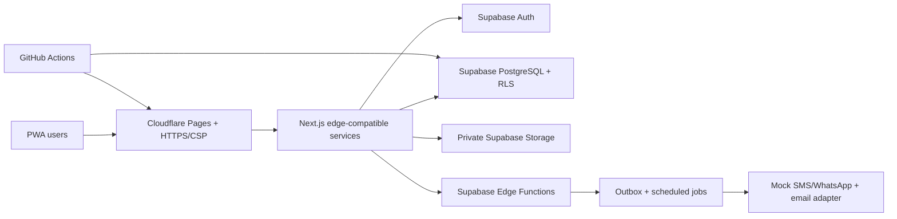
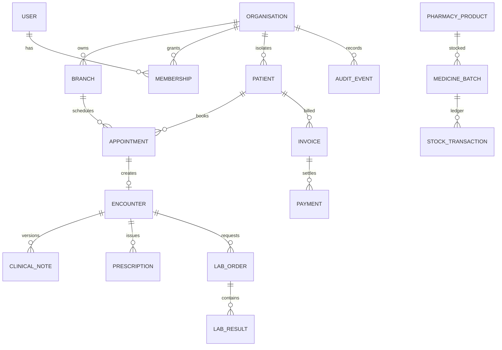

# Product and architecture

## Assumptions and phased scope

Assumptions: one organisation can own many branches; every operational record belongs to one organisation; branch-specific records also carry a branch ID; Aadhaar remains optional; taxes, retention, interactions, consent wording, and numbering rules are configurable; Telugu uses translation resources in the production build; this demo contains no real PHI.

**MVP:** organisation/branch administration, authentication/RBAC, patient registry, schedules, appointments/tokens, encounter drafts, prescriptions, billing/payments, basic FEFO pharmacy, PDF documents, localisation, audit events, dashboard/reports.

**Phase 2:** laboratory workflows, patient OTP portal, notification adapters, clinical templates, consent and document uploads, discounts/refunds approvals, supplier purchasing, barcode support.

**Phase 3:** optional inpatient module, MAR, wards/beds, advanced analytics, digital signing, enterprise identity, integrations, multi-region disaster recovery.

## Roles and permissions

| Role | Patients | Appointments | Clinical record | Billing | Pharmacy | Lab | Admin |
|---|---|---|---|---|---|---|---|
| Hospital admin | Manage | Manage | Audit view | Manage | Manage | Manage | Organisation |
| Branch admin | Branch | Branch | Audit view | Branch | Branch | Branch | Branch |
| Receptionist | Register/search | Manage | Demographics only | Create/collect | No | Order status | No |
| Doctor | Assigned/view | Own queue | Create/amend | Read | Prescribe | Order/view | No |
| Nurse | Assigned/view | Queue | Vitals/notes | No | MAR only | Collect status | No |
| Pharmacist | Basic view | No | Prescription | Pharmacy bill | Manage | No | No |
| Lab technician | Basic view | No | Ordered context | Lab bill view | No | Process/result | No |
| Accounts | Masked view | No | No | Manage/audit | Financial | Financial | No |
| Patient | Self | Self | Self releases | Self | No | Verified self | No |

Server and database policies must enforce this matrix; hiding UI is never sufficient.

## Key journeys

- **Reception:** search → duplicate check → register → choose doctor/slot → token → arrival → collect payment/receipt.
- **Consultation:** open next token → review allergies/history → save autosaved draft → prescribe/order tests → complete immutable encounter → amendment for later correction.
- **Pharmacy:** open prescription → allergy/duplicate warning → select FEFO batch → block expired stock → collect split payment → stock ledger entry.
- **Laboratory:** accept order → collect specimen → enter values → flag out-of-range → authorised verification → private report release.
- **Billing:** estimate → invoice with sequential number → approval-controlled discount → cash/UPI/card/split payment → receipt/refund/credit note → audit event.

## Recommended free demonstration architecture

For production, move domain services behind NestJS containers, use managed PostgreSQL with PITR, Redis/BullMQ, private S3-compatible storage, managed secrets, WAF, central audit/metrics, and tested backups. Preserve repository and identity adapters to avoid rewriting domain logic.

## Core data model

Every tenant table has `organisation_id`; branch-scoped rows also have `branch_id`. PostgreSQL RLS derives permitted organisation/branch membership from authenticated user claims and membership rows. Composite indexes begin with `organisation_id`; uniqueness such as UHID and invoice number is scoped by organisation.

## API surface

- `POST /auth/login`, `/auth/refresh`, `/auth/logout`, `/auth/otp`
- `GET|POST /organisations/:id/branches`
- `GET|POST /patients`, `GET|PATCH /patients/:id`, `GET /patients/duplicates`
- `GET|POST /appointments`, `PATCH /appointments/:id/status`, `POST /appointments/:id/reschedule`
- `GET|POST /encounters`, `PATCH /encounters/:id/draft`, `POST /encounters/:id/complete`, `POST /encounters/:id/amendments`
- `POST /prescriptions`, `GET /prescriptions/:id/pdf`
- `POST /invoices`, `POST /invoices/:id/payments`, `POST /invoices/:id/refunds`, `GET /receipts/:id/pdf`
- `GET|POST /pharmacy/products`, `POST /stock-transactions`, `POST /dispenses`
- `GET|POST /lab-orders`, `PATCH /lab-orders/:id/status`, `POST /lab-results/:id/verify`
- `GET /reports/*`, `GET /audit-events`, `GET /health`

All mutating endpoints require idempotency keys, permission checks, tenant context, validation, transactions where applicable, and audit events.

## Security and privacy assessment

Highest risks are cross-tenant IDOR, over-privileged roles, leaked medical documents, session theft, unsafe uploads, silent clinical overwrites, and financial ledger tampering. Controls: deny-by-default RLS; server-side RBAC/ABAC; short access tokens and rotating refresh tokens; CSRF protection for cookie flows; CSP and output encoding; allowlisted uploads with size/type validation and malware-scan hook; private buckets and short-lived signed URLs; immutable clinical and financial histories; masked structured logs; encryption; optional MFA; configurable timeout; audit-view access logging; consent/retention/deletion workflows; dependency and secret scanning; tested restore drills.

Indian healthcare, prescription, pharmacy, GST, retention, consent, and data-residency requirements must be verified by qualified legal, tax, and healthcare professionals before launch.

## Hosting choices

| Option | Best for | Key limitation |
|---|---|---|
| Cloudflare Pages + Supabase | Recommended fictional-data demo | Quotas, no SLA, scheduling and cold-start constraints |
| Render | Simple single-provider demo | Sleeping services and changing free database retention |
| Vercel + Supabase | Development preview | Plan terms, cron/function and commercial-use limits |
| Managed containers + PostgreSQL | Low-cost production starter | Paid operations and monitoring required |
| Azure/AWS/GCP managed stack | Enterprise hospital | Governance, contracts, cost and specialist operations |

Current prices and free-tier limits change frequently and must be reverified against official provider documentation before procurement. A reasonable planning range—not a quote—is ₹12k–35k/month for one clinic, ₹35k–90k for five, and ₹1.2L–3.5L for twenty, assuming moderate traffic and excluding SMS, implementation, support, compliance, and unusually large imaging storage.

## Roadmap and acceptance gates

1. Product prototype (this workspace): validate navigation and workflows with fictional data.
2. Next.js/TypeScript shell: MUI, PWA, i18n resources, accessibility and component tests.
3. Supabase foundation: migrations, RLS cross-tenant tests, auth, seed and health checks.
4. Clinical core: patient, schedule, queue, encounter, prescription and immutable amendments.
5. Revenue operations: invoices, payments, PDF receipts and pharmacy ledger.
6. Lab/portal/jobs: result verification, private files, OTP portal and outbox workers.
7. Hardening: Playwright, API integration, performance, backup restoration, threat review.
8. Demo deployment: Cloudflare/Supabase credentials, redirects, headers and smoke test.

Production acceptance requires passing lint/type/unit/integration/E2E suites, cross-tenant denial tests, restore rehearsal, clinical workflow sign-off, security assessment, legal/privacy review, monitoring and named incident ownership.
